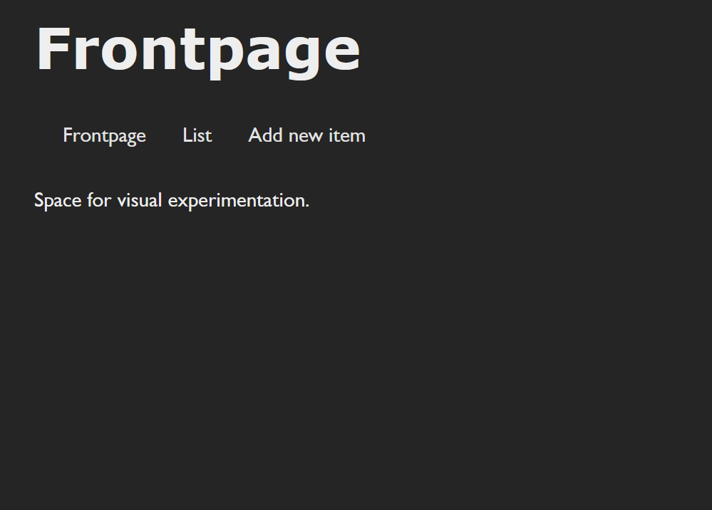
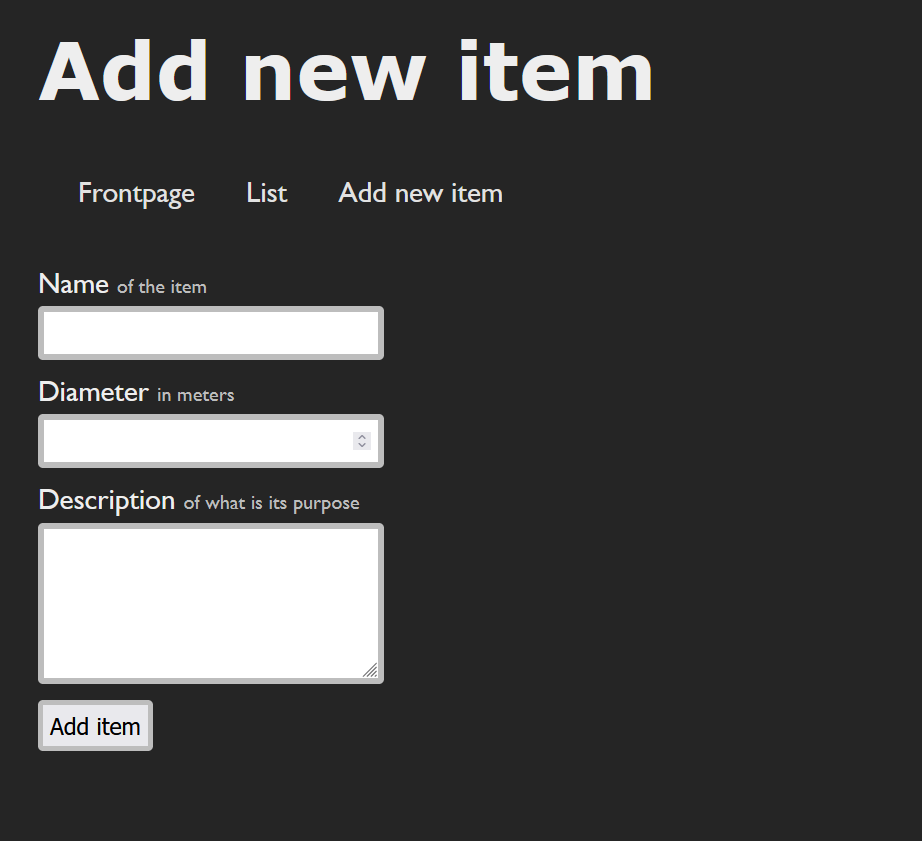
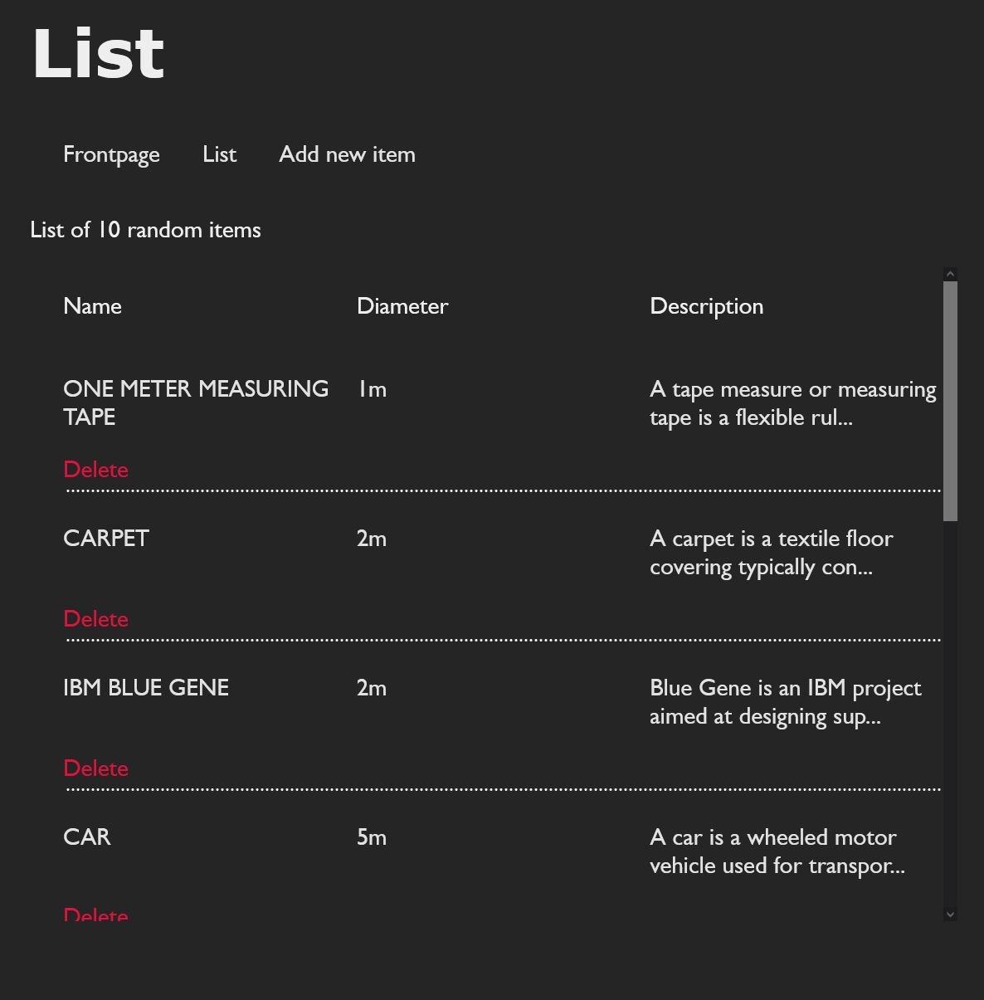
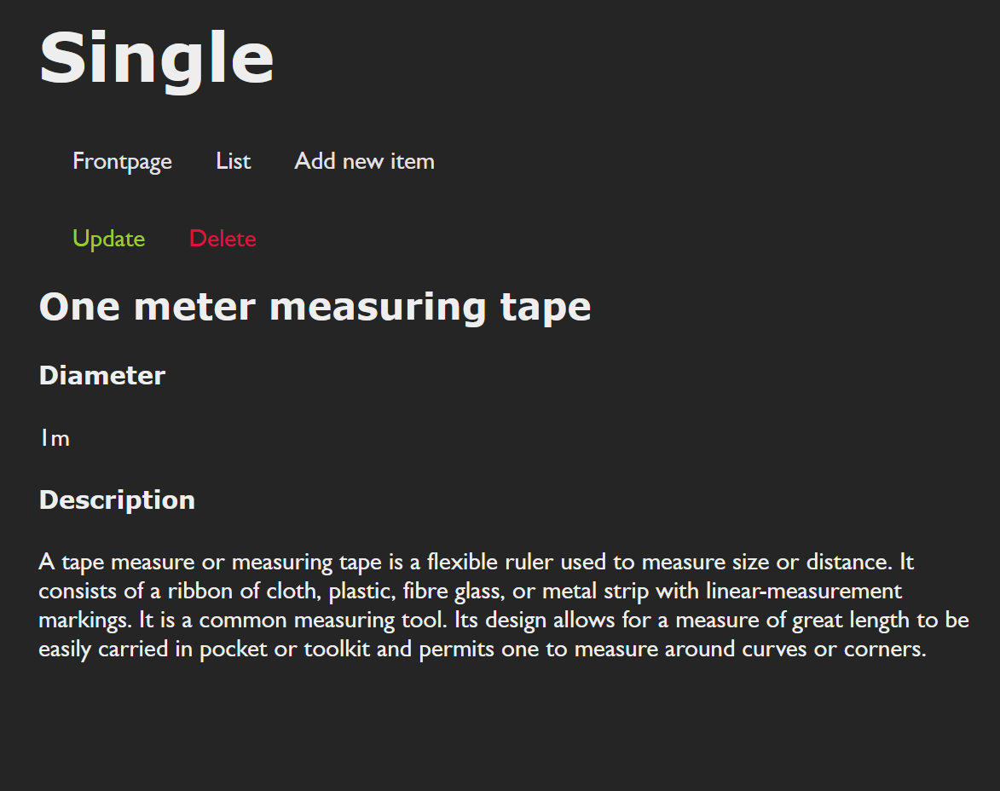

# Short Introduction

This project was used to test how Laravel works and how Rest application could be made using it.

# Requirements

Local server: ``Xampp / MAMP / Wamp / Laragon``

Composer: [`Install Composer`](https://getcomposer.org/)

PHP: [`Install PHP`](https://www.php.net/downloads)

Note: If installation fails check [`Laravel's installation documentation`](https://laravel.com/docs/8.x). I might have forgotten some requirements.
# Installation

Clone from GitHub: `git clone https://github.com/pettmatt/laravel-rest-itemlist.git`

Install composer dependencies: `composer install`

Turn on local server.

Start local server: `php artisan serve`

Note: Remember to ``turn on`` your local server using your chosen application. In my case this would be MAMP. 

Also your local server might need a database named as `laravel_rest_api`.

If everything went as planned you should see the application in your browser.

# The Application

The landing page containing nothing but links and text. Can't remember why I put the text there probably dropped feature.

Using the `Add new item`-page you can easily add a new item

Which can then be viewed on the list page. As you can see the items have a link in them which goes to their own detail page.

Short and simple and you can also update the item from this page. And Delete.

And that concludes the documentation of my REST application which contained requirements, installation and how GET, PUT, POST and DELETE requests are used.

Have a day.